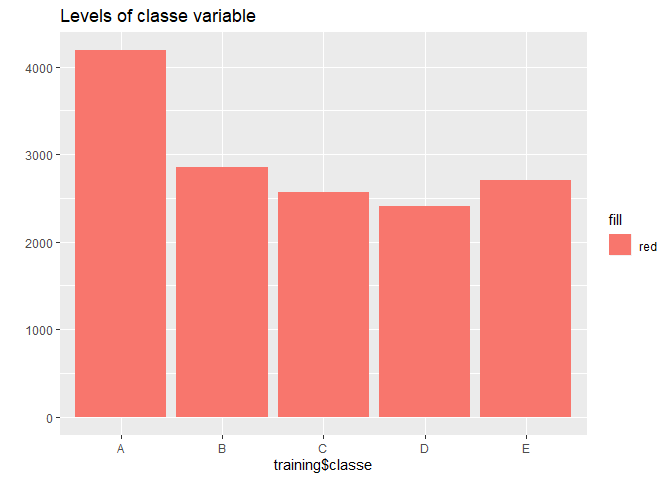
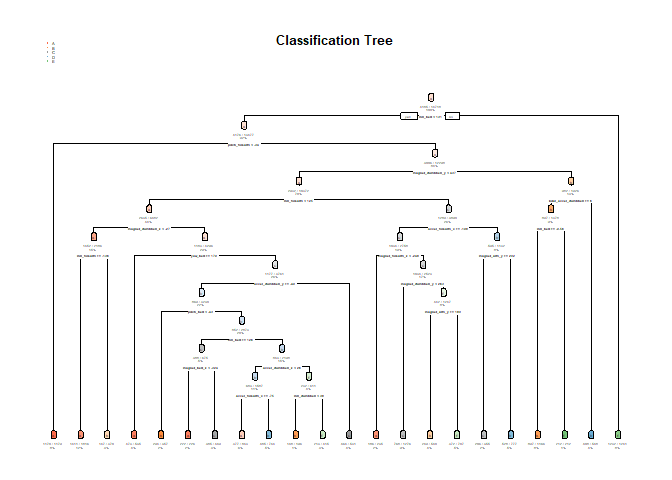

One thing that people regularly do is quantify how much of a particular activity they do, but they rarely quantify how well they do it. In this project, your goal will be to use data from accelerometers on the belt, forearm, arm, and dumbell of 6 participants.

An overall pseudo-random number generator seed was set at 27 for all code.

The outcome variable is *classe*, a factor variable with 5 levels. The dataset with 5 classes (sitting-down, standing-up, standing, walking, and sitting) collected on 8 hours of activities of 4 healthy subjects. For this data set, “participants were asked to perform one set of 10 repetitions of the Unilateral Dumbbell Biceps Curl in 5 different fashions:

- exactly according to the specification (Class A)
- throwing the elbows to the front (Class B)
- lifting the dumbbell only halfway (Class C)
- lowering the dumbbell only halfway (Class D)
- throwing the hips to the front (Class E)

Class A corresponds to the specified execution of the exercise, while the other 4 classes correspond to common mistakes. Participants were supervised by an experienced weight lifter to make sure the execution complied to the manner they were supposed to simulate. The exercises were performed by six male participants aged between 20-28 years, with little weight lifting experience.

Read more: http:/groupware.les.inf.puc-rio.br/har#ixzz4TjqneCKa

In this project, we will adjust two different models, decision tree and random forest.The model with the highest accuracy will be chosen as our final model.

**Cross validation**
We will subset the training data into 2 subsamples, taking 75% of the original training data and 25% for the testing data. When the final model is choosen, it will be tested on the original Testing data set.

### Working with the data
Loading the data we need

```r
library(caret)
library(randomForest)
library(rpart)
library(rpart.plot)
```


```r
set.seed(27)
trainingUrl <- "https://d396qusza40orc.cloudfront.net/predmachlearn/pml-training.csv"
testUrl <- "https://d396qusza40orc.cloudfront.net/predmachlearn/pml-testing.csv"
```


```r
trainingData <- read.csv(url(trainingUrl), na.strings=c("NA","#DIV/0!",""))
testingData <- read.csv(url(testUrl), na.strings=c("NA","#DIV/0!",""))
```

Deleting columns with missing values and the columns that we don't need

```r
trainingData<-trainingData[,colSums(is.na(trainingData)) == 0]
testingData <-testingData[,colSums(is.na(testingData)) == 0]

trainingData   <-trainingData[,-c(1:7)]
testingData <-testingData[,-c(1:7)]
```

We create a data partition, the percentage of data that goes to trainig is 75%, we created 2 data set that contains only a susbset of the *trainingData* dataset, one for trainig and the other one for testing the results.

```r
trainSet <- createDataPartition(y=trainingData$classe, p=0.75, list=FALSE)

training <- trainingData[trainSet, ] 
test <- trainingData[-trainSet, ]
```

Notice that classe variable is factor with 5 levels.

```r
class(training$classe)
```

```
## [1] "factor"
```
To have a better idea we plot this information

```r
library(ggplot2)
qplot(training$classe, fill="red", main = "Levels of classe variable")
```

<!-- -->

#### First model
We fit a decision tree algorithm and plot the result.

```r
mod1 <-rpart(classe ~ ., data=training, method="class")
rpart.plot(mod1, main="Classification Tree", extra=102, under=TRUE, faclen=0)
```

<!-- -->

We test the model on the test data set

```r
prediction1 <- predict(mod1, test, type = "class")
confusionMatrix(prediction1, test$classe)
```

```
## Confusion Matrix and Statistics
## 
##           Reference
## Prediction    A    B    C    D    E
##          A 1259  170   49   85   21
##          B   37  568  100   85   84
##          C   44   88  616   52   77
##          D   43   71   66  483   48
##          E   12   52   24   99  671
## 
## Overall Statistics
##                                           
##                Accuracy : 0.7335          
##                  95% CI : (0.7209, 0.7458)
##     No Information Rate : 0.2845          
##     P-Value [Acc > NIR] : < 2.2e-16       
##                                           
##                   Kappa : 0.6612          
##                                           
##  Mcnemar's Test P-Value : < 2.2e-16       
## 
## Statistics by Class:
## 
##                      Class: A Class: B Class: C Class: D Class: E
## Sensitivity            0.9025   0.5985   0.7205  0.60075   0.7447
## Specificity            0.9074   0.9226   0.9355  0.94439   0.9533
## Pos Pred Value         0.7948   0.6499   0.7024  0.67932   0.7821
## Neg Pred Value         0.9590   0.9055   0.9407  0.92344   0.9432
## Prevalence             0.2845   0.1935   0.1743  0.16395   0.1837
## Detection Rate         0.2567   0.1158   0.1256  0.09849   0.1368
## Detection Prevalence   0.3230   0.1782   0.1788  0.14498   0.1750
## Balanced Accuracy      0.9049   0.7606   0.8280  0.77257   0.8490
```


#### Second model
We fit a random forest algorithm.

```r
mod2 <- randomForest(classe ~. , data=training, method="class")
prediction2 <- predict(mod2, test, type = "class")

confusionMatrix(prediction2, test$classe)
```

```
## Confusion Matrix and Statistics
## 
##           Reference
## Prediction    A    B    C    D    E
##          A 1395    7    0    0    0
##          B    0  937   13    0    0
##          C    0    5  842   11    0
##          D    0    0    0  793    0
##          E    0    0    0    0  901
## 
## Overall Statistics
##                                           
##                Accuracy : 0.9927          
##                  95% CI : (0.9899, 0.9949)
##     No Information Rate : 0.2845          
##     P-Value [Acc > NIR] : < 2.2e-16       
##                                           
##                   Kappa : 0.9907          
##                                           
##  Mcnemar's Test P-Value : NA              
## 
## Statistics by Class:
## 
##                      Class: A Class: B Class: C Class: D Class: E
## Sensitivity            1.0000   0.9874   0.9848   0.9863   1.0000
## Specificity            0.9980   0.9967   0.9960   1.0000   1.0000
## Pos Pred Value         0.9950   0.9863   0.9814   1.0000   1.0000
## Neg Pred Value         1.0000   0.9970   0.9968   0.9973   1.0000
## Prevalence             0.2845   0.1935   0.1743   0.1639   0.1837
## Detection Rate         0.2845   0.1911   0.1717   0.1617   0.1837
## Detection Prevalence   0.2859   0.1937   0.1750   0.1617   0.1837
## Balanced Accuracy      0.9990   0.9920   0.9904   0.9932   1.0000
```

Random Forest algorithm performed better than Decision Trees. Accuracy for Decision Tree model is 0.7335 and accuracy for Random Forest model is 0.9927, then we choose the Random Forest model. The expected out-of-sample error is estimated at 0.0073.

#### Final outcome
Using the choosen model on the original testing data set

```r
predictfinal <- predict(mod2, testingData, type="class")
predictfinal
```

```
##  1  2  3  4  5  6  7  8  9 10 11 12 13 14 15 16 17 18 19 20 
##  B  A  B  A  A  E  D  B  A  A  B  C  B  A  E  E  A  B  B  B 
## Levels: A B C D E
```

